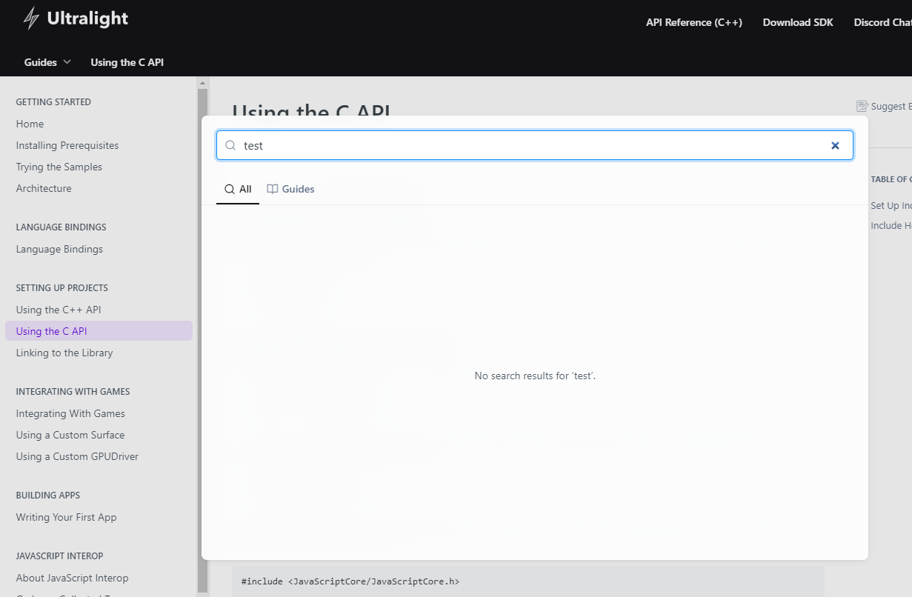

# FHV_DesktopWebApplications
Implementing a ✝-platform time tracking desktop web application using [Ultralight](https://ultralig.ht) and [DaisyUI](https://daisyui.com).

# Start

The application can either be started from within your IDE which requires you to 
setup everything as described in [Ultralight Quickstart](QS_README.md).
However, if you don't want to build the application yourself you can also just run the .exe provided in the 
application.zip. Additionally, we also included a Version built on linux.

# Tests

The tests are in /src/tests.cc, googleTest was used as testing library.
Ultralight as of now does not seem to support any way of End-To-End testing as there is no mention of any testing in
their documentation:

# Other known issues

The scaling of the `<select>` tag in the create task modal doesn't update properly.
At first start everything seems fine but if we add elements to it the scaling gets weird, 
this even happens when removing and creating the select element from scratch. 
Interestingly, we also run into a segfault if this scaling issue occurs and we click around in the select element too much.
We highly suspect it to be a general issue with ultralight as there have been previous issues on github describing problems with the `select` element.

Some other features like Date Selection, Alerts and Dialogs are not supported by Ultralight yet\
See: https://github.com/ultralight-ux/Ultralight/issues/178

more on this in the presentation ;)